# PES-VCS: Version Control System
**Author:** Aanya K (PES2UG24CS011)
---

## System Architecture
This project implements a subset of Git’s core functionality in C. It manages data through a Content-Addressable Storage (CAS) system, using SHA-1 hashing to ensure data integrity and deduplication.

### Core Components:
* **Object Store:** Handles sharded storage of Blobs, Trees, and Commits in .pes/objects.
* **Index (Staging Area):** A persistent cache that tracks changes between the working directory and the next commit.
* **Tree Logic:** Recursively captures directory states and serializes them into binary objects.
* **Commit Logic:** Creates snapshots with parent-child relationships to maintain a verifiable history log.

---

## Phase 1: Object Store Implementation
**Goal:** Implement sharding to prevent directory performance degradation.
* **Logic:** Uses the first 2 characters of a hash as a sub-directory name and the remaining 38 as the filename.
* **Screenshot 1A:** Validation of core object storage and retrieval.
    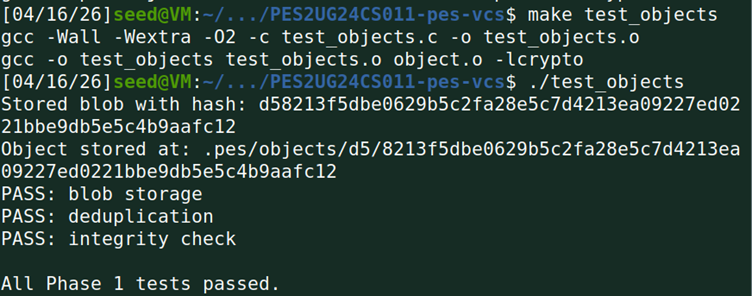
* **Screenshot 1B:** Evidence of the .pes/objects directory sharding.
    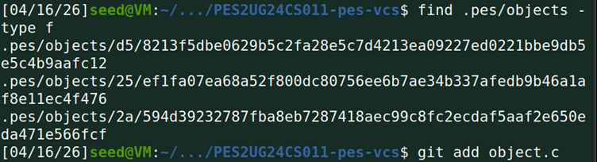

---

## Phase 2: Tree Objects & Serialization
**Goal:** Capture the state of a directory at a specific point in time.
* **Logic:** Trees store entries (mode, type, hash, name). They are stored as binary objects to maintain compact metadata.
* **Screenshot 2A:** Recursive tree construction tests passing.
    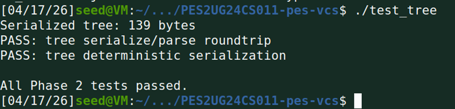
* **Screenshot 2B:** Binary inspection of a tree object using xxd.
    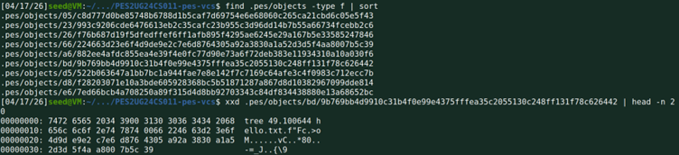

---

## Phase 3: Staging Area (The Index)
**Goal:** Manage a "middle ground" before committing.
* **Logic:** The index is a text-based manifest of filenames and their corresponding hashes, allowing for partial commits.
* **Screenshot 3A:** Execution of init, add, and status.
    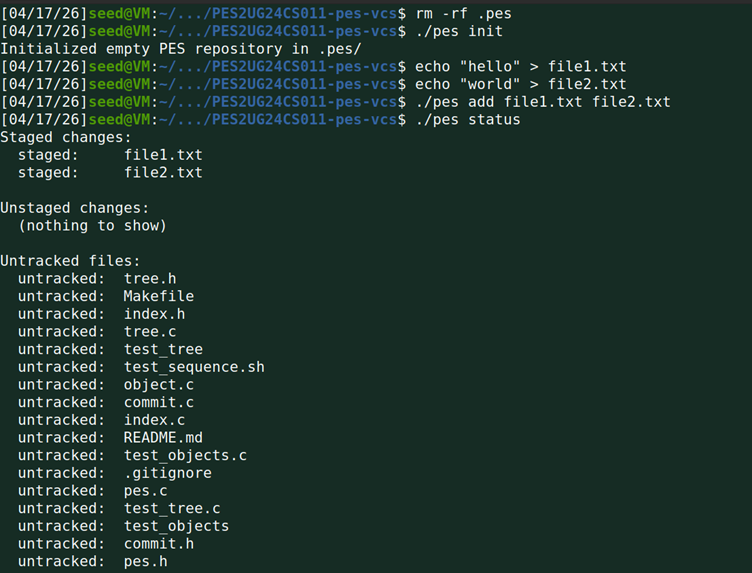
* **Screenshot 3B:** Internal view of the index file.
    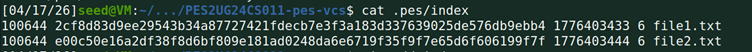

---

## Phase 4: Commits, Logs, and Refs
**Goal:** Linking snapshots to create a navigable history.
* **Logic:** Commits contain a root tree hash, a parent hash (for history), and metadata.
* **Screenshot 4A:** pes log showing the chain of three sequential commits.
    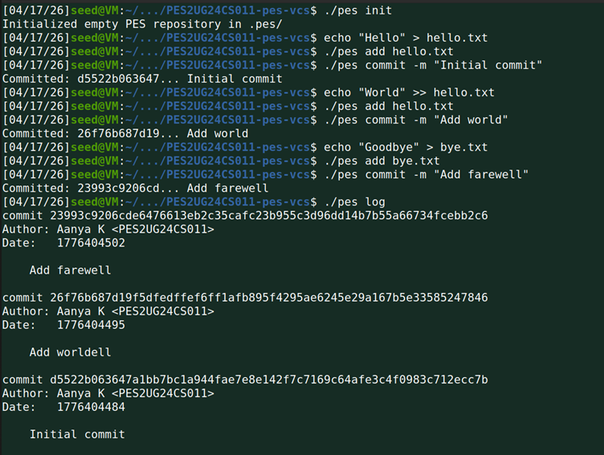
* **Screenshot 4B:** Verification of object growth in the storage layer.
    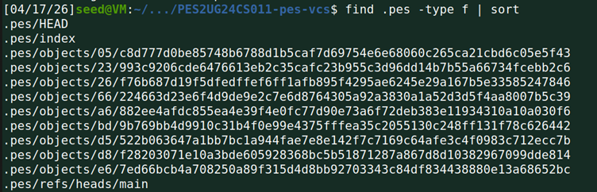
* **Screenshot 4C:** Inspection of HEAD and branch reference files.
    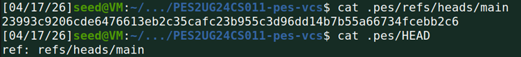

---

## Final Integration
* **Full Integration Test:** Evidence of the complete automated test suite passing.
    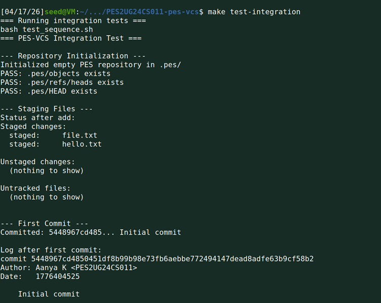
    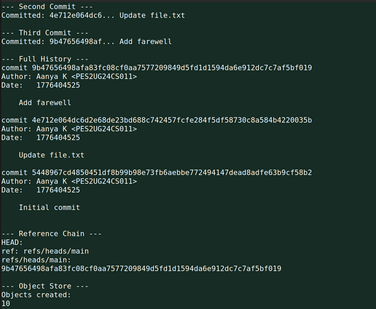
    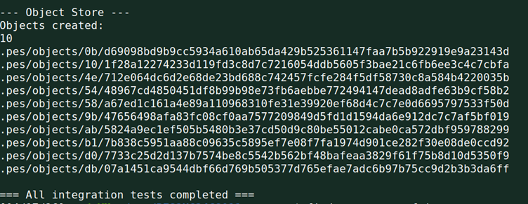

---

## Technical Analysis

### Section 5: Branching & Checkout Dynamics

**Q5.1: How is pes checkout <branch> implemented and why is it complex?**
The checkout command transitions the workspace between different commit states. It involves:
1. Updating .pes/HEAD to point to the new branch ref.
2. Reading the commit hash from the target branch.
3. Recursively traversing the associated Tree object.
4. Overwriting files in the working directory with the Blob data from the object store.
**Complexity:** The primary challenge is "safety." We must ensure that uncommitted changes (dirty files) are not accidentally overwritten and that files present in the current branch but missing in the target branch are correctly deleted from the disk.

**Q5.2: Detecting Dirty Working Directory Conflicts**
Before a checkout or merge, the VCS must check for "dirty" states. This is done by comparing the file’s hash in the Index against a fresh hash of the file currently on Disk. If these hashes differ, the file is modified. If that modified file also differs from the version in the Target Branch, the system must abort to prevent data loss.

**Q5.3: Detached HEAD State**
A "Detached HEAD" occurs when the .pes/HEAD file contains a raw SHA-1 commit hash instead of a symbolic reference like ref: refs/heads/main. This happens when checking out a specific commit. While you can still commit in this state, those commits have no branch pointing to them and may be lost if you switch away. Recovery requires finding the hash in the log and creating a new branch manually: pes branch <name> <hash>.

### Section 6: Garbage Collection (GC) Strategy

**Q6.1: Mark-and-Sweep Algorithm Design**
For a large repository (100k commits), I would implement a Mark-and-Sweep GC:
1. **Mark Phase:** Start at all "known roots" (files in .pes/refs/heads/ and .pes/HEAD). Recursively follow pointers from Commits to Trees, and Trees to Blobs. Tag every reached hash.
2. **Sweep Phase:** Iterate through the physical files in .pes/objects. Any file not tagged in the Mark phase is "unreachable" (dangling) and is safely deleted. This prevents the object store from bloating with obsolete data from deleted branches or failed operations.

**Q6.2: Handling Race Conditions during GC**
A race condition occurs if a user creates a new object (e.g., during a large add operation) at the exact moment the GC Sweep begins. If the Commit object referencing those new Blobs hasn't been written yet, the GC might incorrectly identify the new Blobs as unreachable.
**Prevention:** Git (and PES-VCS) implements a "Grace Period" (typically 2 weeks or a specific timestamp check). The Sweep phase will only delete unreachable objects that are older than a certain threshold, ensuring that "in-flight" objects are preserved.
